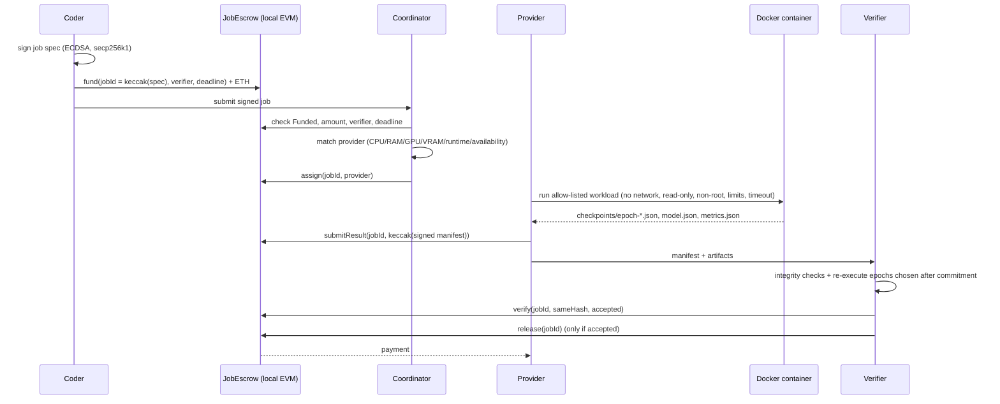

# STESH: Scalable Tokenised Ecosystem for Shared Hardware

[](https://github.com/Pranshurs/verifiable-decentralized-training/actions/workflows/ci.yml)

**Research-to-MVP implementation derived from Pranshu Raj's May 2025 white paper,**
*STESH: Decentralised GPU/CPU Rental for India's AI Compute*.

The paper proposes a peer-to-peer compute market:
- coders submit signed jobs;
- providers run them in containers;
- the result is verified;
- an escrow pays the provider.

This repository builds the smallest version of that loop that actually runs, and proves
the property that matters most: **an honest provider gets paid, and a bad result does
not.**

> The white paper is a pre-beta proposal. Its figures (₹62–83/hour, 10–30 s proofs,
> > 95% uptime, < 5 s matching, a 15-system / 50-task validation, a 100–1,000-user beta)
> are **targets**, not results, and nothing here claims they were achieved. Measured MVP
> numbers are below, next to the targets. Every paper concept is mapped to
> IMPLEMENTED / SIMULATED / EXPERIMENTAL / DEFERRED in
> [`docs/WHITEPAPER_IMPLEMENTATION_MAP.md`](docs/WHITEPAPER_IMPLEMENTATION_MAP.md).
> This historical research project is separate from any later work that reuses the
> STESH name.

## What works end to end



`stesh-mvp-demo` runs all of this against a fresh local chain with real containers:

| Scenario | Outcome |
|---|---|
| Honest provider | Verified (56 checks, all 20 epochs re-executed); escrow **Released**; a second release **reverts** |
| Provider edits `metrics.json` after committing | **Rejected** (committed hash ≠ file); release reverts; coder refunded |
| Provider fabricates a consistent-looking result without computing | **Rejected** (epoch 1 re-execution differs, max \|Δw\| = 0.25); no payment |
| Provider replays an old job's result onto a new job | **Rejected** (manifest bound to a different job id) |
| Provider dies after epoch 8 | Job **reassigned on-chain**; a second provider resumes from the latest AES-GCM-sealed checkpoint; the whole chain is verified; the second provider is paid |

## Components

```
contracts/          JobEscrow.sol (Foundry): fund → assign → submitResult → verify → release | refund
src/stesh_mvp/
  jobs.py           signed canonical job spec (job id = keccak; EIP-191 ECDSA)
  providers.py      signed provider profiles, deterministic hardware-aware matching
  executor.py       locked-down Docker execution of allow-listed workloads
  workloads/        logreg-sgd@1: numpy logistic-regression SGD, checkpoint every epoch
  commitments.py    artifact hashes, Merkle roots, provider-signed result manifest
  verifier.py       integrity checks + post-commitment re-execution (not ZK; see below)
  checkpoints.py    AES-256-GCM checkpoints, content-addressed store, stale-resume refusal
  chain.py          Anvil + escrow client; every party signs its own transactions
  protocol.py       Coordinator, ProviderAgent, VerifierService
  scenario.py       the local network and the attack scenarios (shared by tests, demo, bench)
legacy/2025-08-prototype/   the original August 2025 simulation, kept unchanged
```

All roles run in one process for the MVP. They interact only through the chain and the
files a provider hands over.

## Quick start

You need Python 3.10+, [Foundry](https://book.getfoundry.sh) (`forge`, `anvil`) and
Docker. Nothing needs a GPU, a cloud account or real money.

```bash
git clone --recurse-submodules https://github.com/Pranshurs/verifiable-decentralized-training.git
cd verifiable-decentralized-training
pip install -e ".[dev]"
make contracts image        # forge build; docker build the workload image
make demo                   # the five scenarios above
make test                   # unit tests + end-to-end tests on Anvil + Docker
make contract-test          # Foundry tests for the escrow
make bench                  # writes benchmarks/results.json
```

## Matching

Matching starts with a hard filter. A provider must be:
- available and below its job limit;
- CPU ≥ required, and RAM ≥ required;
- offering the required runtime;
- for GPU jobs, fitted with a GPU with enough VRAM.

Eligible providers are then ranked, and the first difference wins:
1. fewer active jobs;
2. not wasting a GPU on a CPU job;
3. tightest capacity fit;
4. reputation (every provider scores 0 until a reputation system exists);
5. address.

Results are deterministic and tested, including the tie-break order. Hardware claims
are signed but self-reported.

## Proof-of-Compute in this MVP

The paper proposes zero-knowledge proofs. **This MVP doesn't use zero-knowledge proofs.**
Its verifier ([`docs/VERIFICATION.md`](docs/VERIFICATION.md)) checks two layers.

**Integrity:**
- the provider's signature;
- binding to this job;
- the input and artifact Merkle commitments;
- the on-chain hash.

**Re-execution:**
- checkpoint 0 is derived from the data;
- epoch transitions are re-run, chosen *after* the provider committed;
- the model equals the final checkpoint;
- the metrics are recomputed.

The verifier re-runs all epochs by default, so a result that doesn't come from the
committed data and procedure isn't paid. With sampling (`k < E`), the miss probability
is exactly `C(E−f, k)/C(E, k)`.

What it doesn't provide:
- privacy: the provider and the verifier see the data;
- cheap verification of large models;
- verification of workloads without a re-executor (those fail closed).

**ZK status:** an experimental single-step proof exists (see [ZK experiment](#zk-experiment)); general ZK Proof-of-Compute is deferred.

## Escrow contract

`JobEscrow.sol` holds plain ETH (test ETH locally). There is no token. It enforces:
- the provider can't release, verify or reassign;
- payment requires the verifier to accept the exact hash the provider submitted;
- a rejected result never pays;
- release happens at most once (state moves before the transfer);
- refunds are allowed only when unassigned, rejected, past the deadline, or when the
  verifier is silent past the verify window.

There are 17 Foundry tests, including a fuzzed caller and re-entrant provider and coder
contracts.

## Benchmarks (one machine)

Measured on Apple Silicon (macOS), with Docker in a Linux arm64 VM (Colima) and a local
Anvil chain, over 5 runs. The values are medians from
[`benchmarks/results.json`](benchmarks/results.json).

| Metric | White-paper target | MVP measurement |
|---|---|---|
| Provider matching | < 5 s | 0.03 ms (100 providers), 4.0 ms (10,000), 41 ms (100,000); in memory |
| Proof generation | 10–30 s (ZK), < 5 s later | no ZK proof; verification incl. on-chain verdict: **0.15 s** (all 20 epochs re-executed) |
| Transaction cost | ₹0.8/tx (Arbitrum) | gas: fund 118,852, release 47,033 (₹ cost not measured; local chain) |
| Local-chain transaction latency | — | about 0.12 s per transaction (mostly client receipt polling) |
| Container start (no-op) | — | 0.10 s |
| Workload (20 epochs, 569 rows) | — | 0.31 s |
| End-to-end job (fund → paid) | — | **0.97 s** |
| Checkpoint sealing (AES-256-GCM) | — | 0.3 ms per checkpoint |
| Provider failure → resumed result committed | — | 0.57 s |
| Uptime | > 95% | not measured (no long-running network) |
| Price | ₹62–83/hour | not modelled |

These numbers describe a tiny CPU workload on one machine. They say nothing about
network latency, real provider fleets or large models.

## Threat model

[`docs/THREAT_MODEL.md`](docs/THREAT_MODEL.md) classifies each threat as mitigated,
partial or out of scope, and names the test that covers it.

**Mitigated:**
- result tampering, fabrication and replay;
- tampering with job terms;
- double release;
- provider self-release;
- checkpoint tampering, wrong-key use and staleness;
- timeouts.

**Partial:**
- container escape (one shared kernel);
- false hardware claims;
- provider DoS;
- coordinator compromise.

**Out of scope:**
- a colluding verifier;
- data privacy;
- sybil attacks and reputation;
- public-chain MEV;
- key management.

## ZK experiment

A general zero-knowledge proof of ML training is an open research problem, and the MVP's
correctness doesn't depend on one. As a bounded experiment,
[`zk/sgd_step.circom`](zk/sgd_step.circom) is a circom 2 / snarkjs Groth16 circuit that
proves **one fixed-point gradient step** on a private 4-row batch is correct. It works
against salted Poseidon commitments and reveals neither the weights nor the data.

| Measure | Result |
|---|---|
| Constraints | 3,153 |
| Proving time | 0.65 s |
| Verification time | 0.43 s |
| Cheating witness | Can't be produced |
| Proof checked against a different commitment | Fails |

It is labelled **experimental**:
- it uses linear regression, not the MVP's logistic regression;
- it proves one step, not a training run;
- it isn't wired into the escrow;
- it uses a toy single-contributor trusted setup.

Details and limits are in [`docs/ZK_EXPERIMENT.md`](docs/ZK_EXPERIMENT.md). Run it with
`make zk`.

## Limitations

- Single process, one machine, local chain. There's no peer-to-peer networking, provider
  discovery or liveness protocol, and failures are signalled rather than detected.
- There is one workload, and one CPU job at a time. GPU requirements are matched, but
  nothing runs on a GPU.
- Decentralised storage is simulated with a content-addressed local directory. Job keys
  are shared out of band.
- There's no UPI, pricing, reputation, disputes or governance (all deferred; see the map).

## History

`legacy/2025-08-prototype/` is the original August 2025 sketch. It simulated nodes adding
random noise to weights and hashed the result. The MVP replaces it, but the original is
kept for the record.
